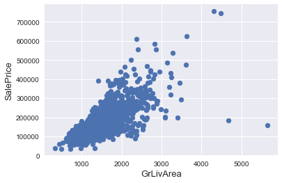
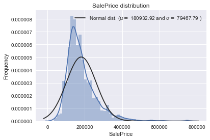
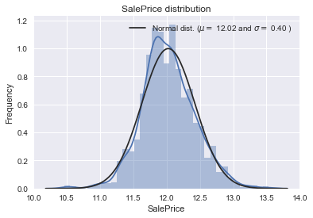
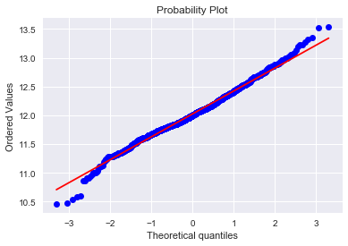
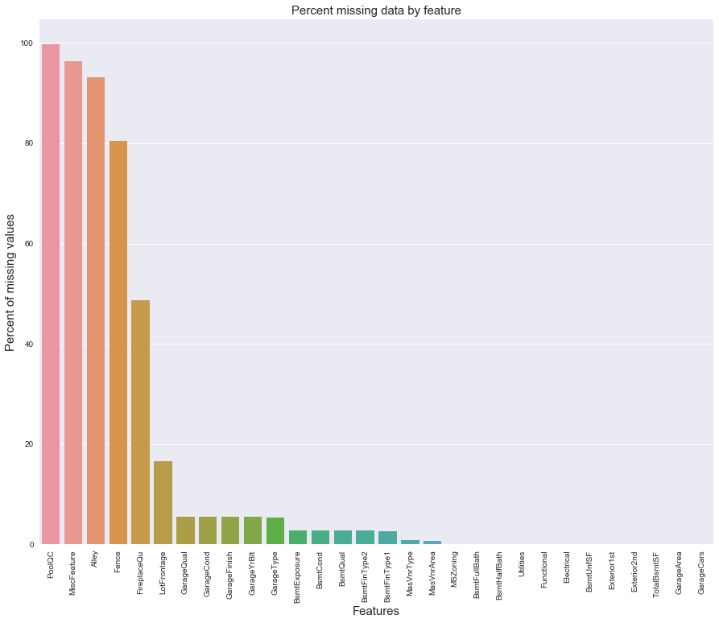
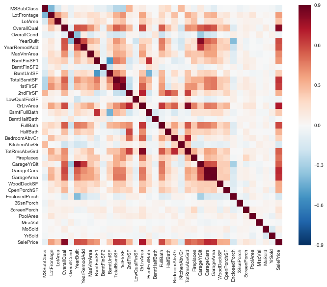

# Kaggle Challenge: House Prices: Advanced Regression Techniques<br>
## Currently in top 5% (143rd in 1890 participants), Last ran on: July 1st, 2017

#### Note: Please refer the notebook for full code.


## Data Sample

<div>
<table border="1" class="dataframe">
  <thead>
    <tr style="text-align: right;">
      <th></th>
      <th>Id</th>
      <th>MSSubClass</th>
      <th>MSZoning</th>
      <th>LotFrontage</th>
      <th>LotArea</th>
      <th>Street</th>
      <th>Alley</th>
      <th>LotShape</th>
      <th>LandContour</th>
      <th>Utilities</th>
      <th>...</th>
      <th>ScreenPorch</th>
      <th>PoolArea</th>
      <th>PoolQC</th>
      <th>Fence</th>
      <th>MiscFeature</th>
      <th>MiscVal</th>
      <th>MoSold</th>
      <th>YrSold</th>
      <th>SaleType</th>
      <th>SaleCondition</th>
    </tr>
  </thead>
  <tbody>
    <tr>
      <th>0</th>
      <td>1461</td>
      <td>20</td>
      <td>RH</td>
      <td>80.000</td>
      <td>11622</td>
      <td>Pave</td>
      <td>NaN</td>
      <td>Reg</td>
      <td>Lvl</td>
      <td>AllPub</td>
      <td>...</td>
      <td>120</td>
      <td>0</td>
      <td>NaN</td>
      <td>MnPrv</td>
      <td>NaN</td>
      <td>0</td>
      <td>6</td>
      <td>2010</td>
      <td>WD</td>
      <td>Normal</td>
    </tr>
    <tr>
      <th>1</th>
      <td>1462</td>
      <td>20</td>
      <td>RL</td>
      <td>81.000</td>
      <td>14267</td>
      <td>Pave</td>
      <td>NaN</td>
      <td>IR1</td>
      <td>Lvl</td>
      <td>AllPub</td>
      <td>...</td>
      <td>0</td>
      <td>0</td>
      <td>NaN</td>
      <td>NaN</td>
      <td>Gar2</td>
      <td>12500</td>
      <td>6</td>
      <td>2010</td>
      <td>WD</td>
      <td>Normal</td>
    </tr>
    <tr>
      <th>2</th>
      <td>1463</td>
      <td>60</td>
      <td>RL</td>
      <td>74.000</td>
      <td>13830</td>
      <td>Pave</td>
      <td>NaN</td>
      <td>IR1</td>
      <td>Lvl</td>
      <td>AllPub</td>
      <td>...</td>
      <td>0</td>
      <td>0</td>
      <td>NaN</td>
      <td>MnPrv</td>
      <td>NaN</td>
      <td>0</td>
      <td>3</td>
      <td>2010</td>
      <td>WD</td>
      <td>Normal</td>
    </tr>
    <tr>
      <th>3</th>
      <td>1464</td>
      <td>60</td>
      <td>RL</td>
      <td>78.000</td>
      <td>9978</td>
      <td>Pave</td>
      <td>NaN</td>
      <td>IR1</td>
      <td>Lvl</td>
      <td>AllPub</td>
      <td>...</td>
      <td>0</td>
      <td>0</td>
      <td>NaN</td>
      <td>NaN</td>
      <td>NaN</td>
      <td>0</td>
      <td>6</td>
      <td>2010</td>
      <td>WD</td>
      <td>Normal</td>
    </tr>
    <tr>
      <th>4</th>
      <td>1465</td>
      <td>120</td>
      <td>RL</td>
      <td>43.000</td>
      <td>5005</td>
      <td>Pave</td>
      <td>NaN</td>
      <td>IR1</td>
      <td>HLS</td>
      <td>AllPub</td>
      <td>...</td>
      <td>144</td>
      <td>0</td>
      <td>NaN</td>
      <td>NaN</td>
      <td>NaN</td>
      <td>0</td>
      <td>1</td>
      <td>2010</td>
      <td>WD</td>
      <td>Normal</td>
    </tr>
  </tbody>
</table>
<p>5 rows × 80 columns</p>
</div>


#Data Processing

##Outliers

[Documentation][1] for the Ames Housing Data indicates that there are outliers present in the training data
[1]: http://ww2.amstat.org/publications/jse/v19n3/Decock/DataDocumentation.txt

Let's explore these outliers


```python

fig, ax = plt.subplots()
ax.scatter(x = train['GrLivArea'], y = train['SalePrice'])
plt.ylabel('SalePrice', fontsize=13)
plt.xlabel('GrLivArea', fontsize=13)
plt.show()

```





We can see at the bottom right two with extremely large GrLivArea that are of a low price. These values are huge oultliers.
Therefore, we can safely delete them.


###Note : 
 Outliers removal is note always safe.  We decided to delete these two as they are very huge and  really  bad ( extremely large areas for very low  prices). 

There are probably others outliers in the training data.   However, removing all them  may affect badly our models if ever there were also  outliers  in the test data. That's why , instead of removing them all, we will just manage to make some of our  models robust on them. You can refer to  the modelling part of this notebook for that. 

##Target Variable

**SalePrice** is the variable we need to predict. So let's do some analysis on this variable first.


    





The target variable is right skewed.  As (linear) models love normally distributed data , we need to transform this variable and make it more normally distributed.

 **Log-transformation of the target variable**


    








The skew seems now corrected and the data appears more normally distributed. 

##Features engineering

let's first  concatenate the train and test data in the same dataframe


    

###Missing Data


<div>
<table border="1" class="dataframe">
  <thead>
    <tr style="text-align: right;">
      <th></th>
      <th>Missing Ratio</th>
    </tr>
  </thead>
  <tbody>
    <tr>
      <th>PoolQC</th>
      <td>99.691</td>
    </tr>
    <tr>
      <th>MiscFeature</th>
      <td>96.400</td>
    </tr>
    <tr>
      <th>Alley</th>
      <td>93.212</td>
    </tr>
    <tr>
      <th>Fence</th>
      <td>80.425</td>
    </tr>
    <tr>
      <th>FireplaceQu</th>
      <td>48.680</td>
    </tr>
    <tr>
      <th>LotFrontage</th>
      <td>16.661</td>
    </tr>
    <tr>
      <th>GarageQual</th>
      <td>5.451</td>
    </tr>
    <tr>
      <th>GarageCond</th>
      <td>5.451</td>
    </tr>
    <tr>
      <th>GarageFinish</th>
      <td>5.451</td>
    </tr>
    <tr>
      <th>GarageYrBlt</th>
      <td>5.451</td>
    </tr>
    <tr>
      <th>GarageType</th>
      <td>5.382</td>
    </tr>
    <tr>
      <th>BsmtExposure</th>
      <td>2.811</td>
    </tr>
    <tr>
      <th>BsmtCond</th>
      <td>2.811</td>
    </tr>
    <tr>
      <th>BsmtQual</th>
      <td>2.777</td>
    </tr>
    <tr>
      <th>BsmtFinType2</th>
      <td>2.743</td>
    </tr>
    <tr>
      <th>BsmtFinType1</th>
      <td>2.708</td>
    </tr>
    <tr>
      <th>MasVnrType</th>
      <td>0.823</td>
    </tr>
    <tr>
      <th>MasVnrArea</th>
      <td>0.788</td>
    </tr>
    <tr>
      <th>MSZoning</th>
      <td>0.137</td>
    </tr>
    <tr>
      <th>BsmtFullBath</th>
      <td>0.069</td>
    </tr>
  </tbody>
</table>
</div>





**Data Correlation**





###Imputing missing values 

We impute them  by proceeding sequentially  through features with missing values 

- **PoolQC** : data description says NA means "No  Pool". That make sense, given the huge ratio of missing value (+99%) and majority of houses have no Pool at all in general. 


```python
all_data["PoolQC"] = all_data["PoolQC"].fillna("None")
```

- **MiscFeature** : data description says NA means "no misc feature"


```python
all_data["MiscFeature"] = all_data["MiscFeature"].fillna("None")
```

- **Alley** : data description says NA means "no alley access"


```python
all_data["Alley"] = all_data["Alley"].fillna("None")
```

- **Fence** : data description says NA means "no fence"


```python
all_data["Fence"] = all_data["Fence"].fillna("None")
```

- **FireplaceQu** : data description says NA means "no fireplace"


```python
all_data["FireplaceQu"] = all_data["FireplaceQu"].fillna("None")
```

- **LotFrontage** : Since the area of each street connected to the house property most likely have a similar area to other houses in its neighborhood , we can **fill in missing values by the median LotFrontage of the neighborhood**.


```python
#Group by neighborhood and fill in missing value by the median LotFrontage of all the neighborhood
all_data["LotFrontage"] = all_data.groupby("Neighborhood")["LotFrontage"].transform(
    lambda x: x.fillna(x.median()))
```

- **GarageType, GarageFinish, GarageQual and GarageCond** : Replacing missing data with None


```python
for col in ('GarageType', 'GarageFinish', 'GarageQual', 'GarageCond'):
    all_data[col] = all_data[col].fillna('None')
```

- **GarageYrBlt, GarageArea and GarageCars** : Replacing missing data with 0 (Since No garage = no cars in such garage.)


```python
for col in ('GarageYrBlt', 'GarageArea', 'GarageCars'):
    all_data[col] = all_data[col].fillna(0)
```

- **BsmtFinSF1, BsmtFinSF2, BsmtUnfSF, TotalBsmtSF, BsmtFullBath and BsmtHalfBath** : missing values are likely zero for having no basement


```python
for col in ('BsmtFinSF1', 'BsmtFinSF2', 'BsmtUnfSF','TotalBsmtSF', 'BsmtFullBath', 'BsmtHalfBath'):
    all_data[col] = all_data[col].fillna(0)
```

- **BsmtQual, BsmtCond, BsmtExposure, BsmtFinType1 and BsmtFinType2** : For all these categorical basement-related features, NaN means that there is no  basement.


```python
for col in ('BsmtQual', 'BsmtCond', 'BsmtExposure', 'BsmtFinType1', 'BsmtFinType2'):
    all_data[col] = all_data[col].fillna('None')
```

- **MasVnrArea and MasVnrType** : NA most likely means no masonry veneer for these houses. We can fill 0 for the area and None for the type. 


```python
all_data["MasVnrType"] = all_data["MasVnrType"].fillna("None")
all_data["MasVnrArea"] = all_data["MasVnrArea"].fillna(0)
```

- **MSZoning (The general zoning classification)** :  'RL' is by far  the most common value.  So we can fill in missing values with 'RL'


```python
all_data['MSZoning'] = all_data['MSZoning'].fillna(all_data['MSZoning'].mode()[0])
```

- **Utilities** : For this categorical feature all records are "AllPub", except for one "NoSeWa"  and 2 NA . Since the house with 'NoSewa' is in the training set, **this feature won't help in predictive modelling**. We can then safely  remove it.


```python
all_data = all_data.drop(['Utilities'], axis=1)
```

- **Functional** : data description says NA means typical


```python
all_data["Functional"] = all_data["Functional"].fillna("Typ")
```

- **Electrical** : It has one NA value. Since this feature has mostly 'SBrkr', we can set that for the missing value.


```python
all_data['Electrical'] = all_data['Electrical'].fillna(all_data['Electrical'].mode()[0])
```

- **KitchenQual**: Only one NA value, and same as Electrical, we set 'TA' (which is the most frequent)  for the missing value in KitchenQual.


```python
all_data['KitchenQual'] = all_data['KitchenQual'].fillna(all_data['KitchenQual'].mode()[0])
```

- **Exterior1st and Exterior2nd** : Again Both Exterior 1 & 2 have only one missing value. We will just substitute in the most common string


```python
all_data['Exterior1st'] = all_data['Exterior1st'].fillna(all_data['Exterior1st'].mode()[0])
all_data['Exterior2nd'] = all_data['Exterior2nd'].fillna(all_data['Exterior2nd'].mode()[0])
```

- **SaleType** : Fill in again with most frequent which is "WD"


```python
all_data['SaleType'] = all_data['SaleType'].fillna(all_data['SaleType'].mode()[0])
```

- **MSSubClass** : Na most likely means No building class. We can replace missing values with None


```python

all_data['MSSubClass'] = all_data['MSSubClass'].fillna("None")


```

Is there any remaining missing value ? 


<div>
<table border="1" class="dataframe">
  <thead>
    <tr style="text-align: right;">
      <th></th>
      <th>Missing Ratio</th>
    </tr>
  </thead>
  <tbody>
  </tbody>
</table>
</div>


It remains no missing value.


###More features engeneering

**Transforming some numerical variables that are really categorical**


**Label Encoding some categorical variables that may contain information in their ordering set** 


**Adding one more important feature**

Since area related features are very important to determine house prices, we add one more feature which is the total area of basement, first and second floor areas of each house


**Skewed features**


    


<div>
<table border="1" class="dataframe">
  <thead>
    <tr style="text-align: right;">
      <th></th>
      <th>Skew</th>
    </tr>
  </thead>
  <tbody>
    <tr>
      <th>MiscVal</th>
      <td>21.940</td>
    </tr>
    <tr>
      <th>PoolArea</th>
      <td>17.689</td>
    </tr>
    <tr>
      <th>LotArea</th>
      <td>13.109</td>
    </tr>
    <tr>
      <th>LowQualFinSF</th>
      <td>12.085</td>
    </tr>
    <tr>
      <th>3SsnPorch</th>
      <td>11.372</td>
    </tr>
    <tr>
      <th>LandSlope</th>
      <td>4.973</td>
    </tr>
    <tr>
      <th>KitchenAbvGr</th>
      <td>4.301</td>
    </tr>
    <tr>
      <th>BsmtFinSF2</th>
      <td>4.145</td>
    </tr>
    <tr>
      <th>EnclosedPorch</th>
      <td>4.002</td>
    </tr>
    <tr>
      <th>ScreenPorch</th>
      <td>3.945</td>
    </tr>
  </tbody>
</table>
</div>


**Box Cox Transformation of (highly) skewed features**

We use the scipy  function boxcox1p which computes the Box-Cox transformation of **\\(1 + x\\)**. 

Note that setting \\( \lambda = 0 \\) is equivalent to log1p used above for the target variable.  

See [this page][1] for more details on Box Cox Transformation as well as [the scipy function's page][2]
[1]: http://onlinestatbook.com/2/transformations/box-cox.html
[2]: https://docs.scipy.org/doc/scipy-0.19.0/reference/generated/scipy.special.boxcox1p.html


    There are 59 skewed numerical features to Box Cox transform
    


#Modelling

In this approach, we add a meta-model on averaged base models and use the out-of-folds predictions of these base models to train our meta-model. 

The procedure, for the training part, may be described as follows:


1. Split the total training set into two disjoint sets (here **train** and .**holdout** )

2. Train several base models on the first part (**train**)

3. Test these base models on the second part (**holdout**)

4. Use the predictions from 3)  (called  out-of-folds predictions) as the inputs, and the correct responses (target variable) as the outputs  to train a higher level learner called **meta-model**.

The first three steps are done iteratively . If we take for example a 5-fold stacking , we first split the training data into 5 folds. Then we will do 5 iterations. In each iteration,  we train every base model on 4 folds and predict on the remaining fold (holdout fold). 

So, we will be sure, after 5 iterations , that the entire data is used to get out-of-folds predictions that we will then use as 
new feature to train our meta-model in the step 4.

For the prediction part , We average the predictions of  all base models on the test data  and used them as **meta-features**  on which, the final prediction is done with the meta-model.


(Image taken from [Faron](https://www.kaggle.com/getting-started/18153#post103381))


Gif taken from [KazAnova's interview](http://blog.kaggle.com/2017/06/15/stacking-made-easy-an-introduction-to-stacknet-by-competitions-grandmaster-marios-michailidis-kazanova/)

On this gif, the base models are algorithms 0, 1, 2 and the meta-model is algorithm 3. The entire training dataset is 
A+B (target variable y known) that we can split into train part (A) and holdout part (B). And the test dataset is C. 

B1 (which is the prediction from the holdout part)  is the new feature used to train the meta-model 3 and C1 (which
is the prediction  from the test dataset) is the meta-feature on which the final prediction is done. 


**Define a cross validation strategy**

We use the **cross_val_score** function of Sklearn. However this function has not a shuffle attribut, we add then one line of code,  in order to shuffle the dataset  prior to cross-validation


##Base models

-  **LASSO  Regression**  : 

This model may be very sensitive to outliers. So we need to made it more robust on them. For that we use the sklearn's  **Robustscaler()**  method on pipeline 


```python
lasso = make_pipeline(RobustScaler(), Lasso(alpha =0.0005, random_state=1))
```

- **Elastic Net Regression** :

again made robust to outliers


```python
ENet = make_pipeline(RobustScaler(), ElasticNet(alpha=0.0005, l1_ratio=.9, random_state=3))
```

- **Kernel Ridge Regression** :


```python
KRR = KernelRidge(alpha=0.6, kernel='polynomial', degree=2, coef0=2.5)
```

- **Gradient Boosting Regression** :

With **huber**  loss that makes it robust to outliers
    


```python
GBoost = GradientBoostingRegressor(n_estimators=3000, learning_rate=0.05,
                                   max_depth=4, max_features='sqrt',
                                   min_samples_leaf=15, min_samples_split=10, 
                                   loss='huber', random_state =5)
```

- **XGBoost** :


```python
#EDIT: changing the xgboost parameters for better CV score

#model_xgb = xgb.XGBRegressor(colsample_bytree=0.2, gamma=0.0, 
#                            learning_rate=0.05, max_depth=6, 
#                             min_child_weight=1.5, n_estimators=7200,
#                             reg_alpha=0.9, reg_lambda=0.6,
#                             subsample=0.2,seed=42, silent=1,
#                             random_state =7)

model_xgb = xgb.XGBRegressor(colsample_bytree=0.4603, gamma=0.0468, 
                             learning_rate=0.05, max_depth=3, 
                             min_child_weight=1.7817, n_estimators=2200,
                             reg_alpha=0.4640, reg_lambda=0.8571,
                             subsample=0.5213, silent=1,
                              nthread = -1)


```

- **LightGBM** :


```python
model_lgb = lgb.LGBMRegressor(objective='regression',num_leaves=5,
                              learning_rate=0.05, n_estimators=720,
                              max_bin = 55, bagging_fraction = 0.8,
                              bagging_freq = 5, feature_fraction = 0.2319,
                              feature_fraction_seed=9, bagging_seed=9,
                              min_data_in_leaf =6, min_sum_hessian_in_leaf = 11)
```

###Base models scores

Let's see how these base models perform on the data by evaluating the  cross-validation rmsle error


```python
score = rmsle_cv(lasso)
print("\nLasso score: {:.4f} ({:.4f})\n".format(score.mean(), score.std()))
```

    
    Lasso score: 0.1115 (0.0074)
    
    


```python
score = rmsle_cv(ENet)
print("ElasticNet score: {:.4f} ({:.4f})\n".format(score.mean(), score.std()))
```

    ElasticNet score: 0.1116 (0.0074)
    
    


```python
score = rmsle_cv(KRR)
print("Kernel Ridge score: {:.4f} ({:.4f})\n".format(score.mean(), score.std()))
```

    Kernel Ridge score: 0.1153 (0.0075)
    
    


```python
score = rmsle_cv(GBoost)
print("Gradient Boosting score: {:.4f} ({:.4f})\n".format(score.mean(), score.std()))
```

    Gradient Boosting score: 0.1177 (0.0080)
    
    


```python

score = rmsle_cv(model_xgb)
print("Xgboost score: {:.4f} ({:.4f})\n".format(score.mean(), score.std()))
```

    Xgboost score: 0.1149 (0.0059)
    
    


```python
score = rmsle_cv(model_lgb)
print("LGBM score: {:.4f} ({:.4f})\n" .format(score.mean(), score.std()))
```

    LGBM score: 0.1151 (0.0055)
    
    

##Stacking  models

###Simplest Stacking approach : Averaging base models

We begin with this simple approach of averaging base models.  We build a new **class**  to extend scikit-learn with our model and also to laverage encapsulation and code reuse ([inheritance][1]) 


  [1]: https://en.wikipedia.org/wiki/Inheritance_(object-oriented_programming)

**Averaged base models class**


```python
class AveragingModels(BaseEstimator, RegressorMixin, TransformerMixin):
    def __init__(self, models):
        self.models = models
        
    # we define clones of the original models to fit the data in
    def fit(self, X, y):
        self.models_ = [clone(x) for x in self.models]
        
        # Train cloned base models
        for model in self.models_:
            model.fit(X, y)

        return self
    
    #Now we do the predictions for cloned models and average them
    def predict(self, X):
        predictions = np.column_stack([
            model.predict(X) for model in self.models_
        ])
        return np.mean(predictions, axis=1)   
```

**Averaged base models score**

We just average four models here **ENet, GBoost,  KRR and lasso**.  Of course we could easily add more models in the mix. 


```python
averaged_models = AveragingModels(models = (ENet, GBoost, KRR, lasso))

score = rmsle_cv(averaged_models)
print(" Averaged base models score: {:.4f} ({:.4f})\n".format(score.mean(), score.std()))
```

     Averaged base models score: 0.1091 (0.0075)
    
    

Wow ! It seems even the simplest stacking approach really improve the score . This encourages 
us to go further and explore a less simple stacking approch. 

###Less simple Stacking : Adding a Meta-model

**Stacking averaged Models Class**


```python
class StackingAveragedModels(BaseEstimator, RegressorMixin, TransformerMixin):
    def __init__(self, base_models, meta_model, n_folds=5):
        self.base_models = base_models
        self.meta_model = meta_model
        self.n_folds = n_folds
   
    # We again fit the data on clones of the original models
    def fit(self, X, y):
        self.base_models_ = [list() for x in self.base_models]
        self.meta_model_ = clone(self.meta_model)
        kfold = KFold(n_splits=self.n_folds, shuffle=True, random_state=156)
        
        # Train cloned base models then create out-of-fold predictions
        # that are needed to train the cloned meta-model
        out_of_fold_predictions = np.zeros((X.shape[0], len(self.base_models)))
        for i, model in enumerate(self.base_models):
            for train_index, holdout_index in kfold.split(X, y):
                instance = clone(model)
                self.base_models_[i].append(instance)
                instance.fit(X[train_index], y[train_index])
                y_pred = instance.predict(X[holdout_index])
                out_of_fold_predictions[holdout_index, i] = y_pred
                
        # Now train the cloned  meta-model using the out-of-fold predictions as new feature
        self.meta_model_.fit(out_of_fold_predictions, y)
        return self
   
    #Do the predictions of all base models on the test data and use the averaged predictions as 
    #meta-features for the final prediction which is done by the meta-model
    def predict(self, X):
        meta_features = np.column_stack([
            np.column_stack([model.predict(X) for model in base_models]).mean(axis=1)
            for base_models in self.base_models_ ])
        return self.meta_model_.predict(meta_features)
```

**Stacking Averaged models Score**

To make the two approaches comparable (by using the same number of models) , we just average **Enet KRR and Gboost**, then we add **lasso as meta-model**.


```python
stacked_averaged_models = StackingAveragedModels(base_models = (ENet, GBoost, KRR),
                                                 meta_model = lasso)

score = rmsle_cv(stacked_averaged_models)
print("Stacking Averaged models score: {:.4f} ({:.4f})".format(score.mean(), score.std()))
```

    Stacking Averaged models score: 0.1085 (0.0074)
    

We get again a better score by adding a meta learner

## Ensembling StackedRegressor, XGBoost and LightGBM

We add **XGBoost and LightGBM** to the** StackedRegressor** defined previously. 

We first define a rmsle evaluation function 


```python
def rmsle(y, y_pred):
    return np.sqrt(mean_squared_error(y, y_pred))
```

###Final Training and Prediction

**StackedRegressor:**


```python
stacked_averaged_models.fit(train.values, y_train)
stacked_train_pred = stacked_averaged_models.predict(train.values)
stacked_pred = np.expm1(stacked_averaged_models.predict(test.values))
print(rmsle(y_train, stacked_train_pred))
```

    0.0781571937916
    

**XGBoost:**


```python
model_xgb.fit(train, y_train)
xgb_train_pred = model_xgb.predict(train)
xgb_pred = np.expm1(model_xgb.predict(test))
print(rmsle(y_train, xgb_train_pred))
```

    0.0785366603111
    

**LightGBM:**


```python
model_lgb.fit(train, y_train)
lgb_train_pred = model_lgb.predict(train)
lgb_pred = np.expm1(model_lgb.predict(test.values))
print(rmsle(y_train, lgb_train_pred))
```

    0.0722556085687
    


```python
'''RMSE on the entire Train data when averaging'''

print('RMSLE score on train data:')
print(rmsle(y_train,stacked_train_pred*0.70 +
               xgb_train_pred*0.15 + lgb_train_pred*0.15 ))
```

    RMSLE score on train data:
    0.0753189601002
    

**Ensemble prediction:**


```python
ensemble = stacked_pred*0.70 + xgb_pred*0.15 + lgb_pred*0.15
```

**Submission**


```python
sub = pd.DataFrame()
sub['Id'] = test_ID
sub['SalePrice'] = ensemble
sub.to_csv('submission.csv',index=False)
```
